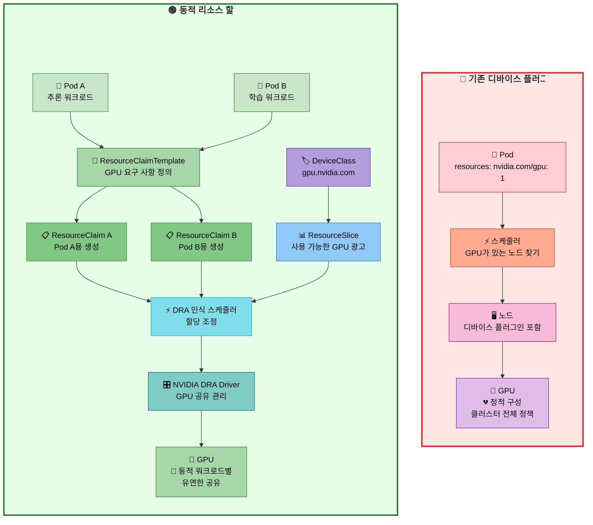
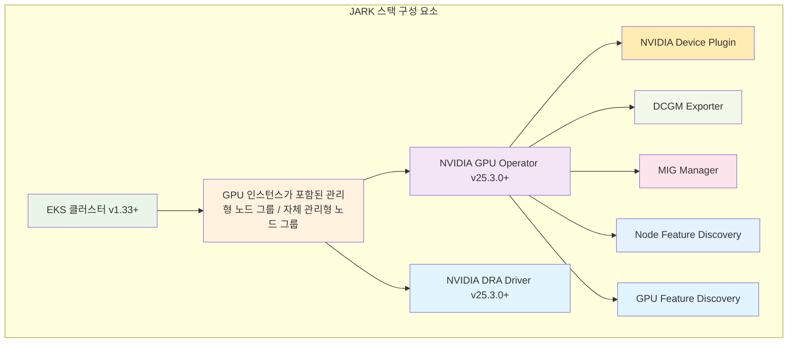

import Tabs from '@theme/Tabs';
import TabItem from '@theme/TabItem';
import CodeBlock from '@theme/CodeBlock';
import Admonition from '@theme/Admonition';
import StatusGrid from '@site/src/components/StatusGrid';
import StatCallout from '@site/src/components/StatCallout';
import SectionDivider from '@site/src/components/SectionDivider';
import ComparisonTable from '@site/src/components/ComparisonTable';
import ProgressSteps from '@site/src/components/ProgressSteps';

# Amazon EKS에서 GPU를 위한 동적 리소스 할당(Dynamic Resource Allocation)

<details>
<summary><strong>TL;DR - EKS에서 DRA를 사용한 동적 GPU 스케줄링</strong></summary>

**DRA는 Kubernetes에서 차세대 GPU 스케줄링 접근 방식입니다.** 동적 리소스 할당(Dynamic Resource Allocation, DRA)은 기존 디바이스 플러그인을 넘어서는 고급 GPU 관리 기능을 제공합니다. 핵심 내용은 다음과 같습니다:

### 기존 GPU 스케줄링 대비 DRA의 장점

- **세밀한 리소스 제어** - 전체 디바이스가 아닌 특정 GPU 메모리 양을 요청 가능
- **워크로드별 공유 전략** - 클러스터 전체가 아닌 Pod별로 `mps`, `time-slicing`, `mig`, `exclusive` 선택 가능
- **토폴로지 인식 스케줄링** - 멀티 GPU 워크로드를 위한 [NVLink](https://www.nvidia.com/en-us/data-center/nvlink/), [IMEX](https://docs.nvidia.com/multi-node-nvlink-systems/imex-guide/overview.html) 및 GPU 인터커넥트 이해
- **고급 GPU 기능** - [Amazon EC2 P6e-GB200 UltraServers](https://aws.amazon.com/ec2/instance-types/p6/)의 [IMEX](https://docs.nvidia.com/multi-node-nvlink-systems/imex-guide/overview.html), 멀티 노드 [NVLink](https://www.nvidia.com/en-us/data-center/nvlink/) 및 차세대 GPU 기능에 필수
- **공존 친화적** - 전환 기간 동안 기존 디바이스 플러그인과 함께 실행 가능

<Admonition type="warning" title="Amazon EC2 P6e-GB200 UltraServer 요구 사항">

- **기존 스케줄링 미지원** - Amazon EC2 P6e-GB200 UltraServers는 **DRA가 필수**이며 NVIDIA 디바이스 플러그인 + kube-scheduler와는 작동하지 않습니다
- **DRA 필수** - 멀티 노드 [NVLink](https://www.nvidia.com/en-us/data-center/nvlink/) 및 [IMEX](https://docs.nvidia.com/multi-node-nvlink-systems/imex-guide/overview.html) 기능은 DRA를 통해서만 사용 가능합니다

</Admonition>

**주요 구현 세부 사항:**

<StatusGrid badges={[
  {
    type: 'production',
    icon: '☸️',
    title: 'EKS 컨트롤 플레인',
    value: 'v1.33+',
    note: 'DRA 기능 게이트 활성화'
  },
  {
    type: 'production',
    icon: '🖥️',
    title: 'EKS 최적화 NVIDIA AMI',
    value: '최신 AMI',
    note: '드라이버 사전 설치'
  },
  {
    type: 'production',
    icon: '🔗',
    title: '관리형 노드 그룹',
    value: '완전한 DRA 지원',
    note: '권장 접근 방식'
  },
  {
    type: 'info',
    icon: '🔧',
    title: '자체 관리형 노드 그룹',
    value: 'DRA 지원',
    note: '수동 구성 필요'
  },
  {
    type: 'production',
    icon: '🛠️',
    title: 'NVIDIA GPU Operator',
    value: 'v25.3.0+',
    note: 'DRA에 필수'
  },
  {
    type: 'production',
    icon: '⚡',
    title: 'NVIDIA DRA Driver',
    value: 'v25.3.0+',
    note: '핵심 DRA 기능'
  },
  {
    type: 'warning',
    icon: '🚧',
    title: 'Karpenter DRA 지원',
    value: '개발 중',
    note: 'GitHub Issue #1231'
  },
  {
    type: 'beta',
    icon: '🔬',
    title: 'DRA 상태',
    value: '베타 (K8s v1.32+)',
    note: '기술 프리뷰'
  }
]} />


- **EKS v1.33** - EKS 최적화 구성에서 DRA 기능 게이트 활성화
- **상세한 DRA 구현** - [Kubernetes DRA 문서](https://kubernetes.io/docs/concepts/scheduling-eviction/dynamic-resource-allocation/) 참조
- **노드 프로비저닝 호환성:**
  - **관리형 노드 그룹(Managed Node Groups)** - 완전한 DRA 지원
  - **자체 관리형 노드 그룹(Self-Managed Node Groups)** - DRA 지원 (수동 구성 필요)
  - **Karpenter** - DRA 지원 개발 중 ([Issue #1231](https://github.com/kubernetes-sigs/karpenter/issues/1231))
- **공존** - 기존 디바이스 플러그인과 DRA를 동시에 실행 가능

### 왜 DRA에 Karpenter 대신 관리형/자체 관리형 노드 그룹인가?

- **관리형/자체 관리형 노드 그룹** - 완전한 DRA 지원, Capacity Block Reservations에 최적화
- **Karpenter** - DRA 지원 개발 중, 동적 스케일링이 예약된 GPU 용량과 충돌
- **EKS 최적화 AMI** - NVIDIA 드라이버가 사전 설치되어 제공

### 기존 GPU 할당과 DRA를 함께 사용할 수 있나요?

- **공존 지원** - 동일한 클러스터에서 동시에 실행 가능
- **DRA가 미래** - NVIDIA와 Kubernetes는 DRA로 독점 전환 중
- **마이그레이션 전략** - 새로운 워크로드에 DRA, 기존 워크로드에는 기존 방식 사용


### 준비 상태

- **기술 프리뷰** - GPU 할당 및 공유 기능은 NVIDIA에서 활발히 개발 중
- **테스트 및 준비 완료** - 멀티 노드 [NVLink](https://www.nvidia.com/en-us/data-center/nvlink/)를 위한 ComputeDomains 완전 지원
- **스케줄링 오버헤드** - 클레임 해결 프로세스로 인한 추가 지연 시간
- **정식 출시** - Kubernetes v1.34 (2025)에서 예상
- **최신 상태 업데이트** - 현재 개발 진행 상황은 [NVIDIA DRA Driver GitHub](https://github.com/NVIDIA/k8s-dra-driver-gpu) 참조

<Admonition type="tip" title="추가 리소스">

EKS에서 AI/ML 워크로드에 대한 종합적인 가이드는 [AWS EKS Best Practices for AI/ML Compute](https://docs.aws.amazon.com/eks/latest/best-practices/aiml-compute.html#aiml-dra)를 참조하십시오.

</Admonition>

</details>

<StatCallout
  icon="💸"
  title="엔터프라이즈 GPU 활용 위기"
  statNumber="60%"
  statLabel="GPU 용량 낭비"
  description="높은 수요에도 불구하고 엔터프라이즈 AI 플랫폼은 스케줄링 제한으로 인해 GPU 리소스의 절반 이상을 지속적으로 낭비합니다. 이는 수백만 달러의 인프라 비용을 의미합니다."
  type="critical"
/>

**높은 수요의 AI 클러스터에서도 GPU 활용률은 종종 40% 미만입니다.** 이는 구성 문제가 아닙니다 - Kubernetes가 GPU 리소스를 추상화하는 방식의 근본적인 한계입니다. 조직들은 GPU 인스턴스에 프리미엄 가격을 지불하면서 대부분의 컴퓨팅 파워를 유휴 상태로 두고 있습니다.

<SectionDivider icon="🎛️" />

## Kubernetes에서의 GPU 스케줄링 과제

### 현재 상태: 기존 GPU 할당

Kubernetes는 빠르게 엔터프라이즈 환경에서 AI/ML 워크로드를 오케스트레이션하는 사실상의 표준으로 진화했으며, Amazon EKS는 대규모 GPU 가속 인프라를 관리하는 선도적인 플랫폼으로 부상했습니다. 조직들은 P4d, P5 및 최신 P6 시리즈와 같은 GPU 인스턴스를 활용하여 소규모 추론 서비스부터 대규모 분산 학습 작업까지 모든 것을 EKS 클러스터에서 실행하고 있습니다.

그러나 Kubernetes가 컨테이너화된 워크로드를 관리하는 데 정교함에도 불구하고, 기존 GPU 스케줄링 모델은 놀라울 정도로 원시적이며 상당한 운영 과제를 만들어냅니다. 현재 접근 방식은 GPU를 단위로만 할당할 수 있는 단순하고 원자적인 리소스로 취급하며, 이는 현대 AI 워크로드의 다양하고 진화하는 요구 사항과 근본적으로 맞지 않습니다.

**기존 GPU 스케줄링 작동 방식:**
- Pod는 간단한 정수 값을 사용하여 GPU를 요청: `nvidia.com/gpu: 1`
- 스케줄러는 GPU를 불투명하고 분할 불가능한 리소스로 취급
- 각 워크로드는 전체 GPU 디바이스에 대한 독점 접근 권한 획득
- 실제 리소스 요구 사항이나 GPU 토폴로지에 대한 인식 없음

**이 접근 방식의 문제점:**
현대 AI 워크로드는 이 이진 모델에 맞지 않는 다양한 요구 사항을 가지고 있습니다:
- **소규모 추론 작업**은 2-4GB GPU 메모리만 필요하지만 전체 80GB A100이 할당됨
- **대규모 학습 작업**은 [NVLink](https://www.nvidia.com/en-us/data-center/nvlink/) 또는 [IMEX](https://docs.nvidia.com/multi-node-nvlink-systems/imex-guide/overview.html)를 통한 조정된 멀티 GPU 통신이 필요
- **혼합 워크로드**는 GPU를 효율적으로 공유할 수 있지만 별도의 디바이스로 강제됨

### GPU 활용 위기

<Admonition type="warning" title="라이브 환경의 심각한 비효율성">

**높은 수요의 클러스터에서도 GPU 활용률은 종종 40% 미만입니다.** 이는 구성 문제가 아닙니다: Kubernetes가 GPU 리소스를 추상화하는 방식의 근본적인 한계입니다.

</Admonition>

**비효율적인 GPU 할당의 일반적인 증상:**

- **큐 기아 상태(Queue starvation)** - 소규모 추론 작업이 장시간 실행되는 학습 작업 뒤에서 대기
- **리소스 단편화(Resource fragmentation)** - GPU 메모리가 노드 전체에 사용할 수 없는 조각으로 분산
- **토폴로지 무인식(Topology blindness)** - 멀티 GPU 작업이 최적이 아닌 배치를 받아 [NVLink](https://www.nvidia.com/en-us/data-center/nvlink/) 성능 저하
- **비용 폭발(Cost explosion)** - 조직이 스케줄링 비효율성을 해결하기 위해 GPU를 과다 프로비저닝

<SectionDivider icon="💎" />

## 동적 리소스 할당(DRA) 소개

### DRA가 변경하는 것

동적 리소스 할당은 GPU 스케줄링을 경직된 디바이스 중심 모델에서 유연한 워크로드 인식 접근 방식으로 근본적으로 변환합니다:

**기존 접근 방식:**
```yaml
resources:
  limits:
    nvidia.com/gpu: 1  # 전체 GPU 획득, 커스터마이징 불가
```

**DRA 접근 방식:**
```yaml
resourceClaims:
- name: gpu-claim
  source:
    resourceClaimTemplateName: gpu-template  # 상세한 요구 사항
```

*ResourceClaimTemplate 구성은 아래 예제 섹션을 참조하십시오.*

<Admonition type="warning" title="네임스페이스 요구 사항">

**중요:** ResourceClaims는 이를 참조하는 Pod와 동일한 네임스페이스에 존재해야 합니다. 네임스페이스 간 리소스 클레임은 지원되지 않습니다.

</Admonition>

### 주요 DRA 혁신

<div className="dra-innovations-grid">
  <div className="innovation-card innovation-card--primary">
    <div className="innovation-card__header">
      <div className="innovation-card__icon">🎯</div>
      <h4>세밀한 리소스 제어</h4>
    </div>
    <div className="innovation-card__content">
      <ul className="innovation-card__features">
        <li>특정 GPU 메모리 양 요청 (예: 사용 가능한 80Gi 중 16Gi)</li>
        <li>메모리 요구 사항과 독립적으로 컴퓨팅 요구 사항 지정</li>
        <li>멀티 GPU 워크로드에 대한 토폴로지 제약 정의</li>
      </ul>
      <div className="innovation-card__note">
        <strong>참고:</strong> ResourceClaims와 Pod는 동일한 네임스페이스에 있어야 합니다
      </div>
    </div>
  </div>

  <div className="innovation-card innovation-card--secondary">
    <div className="innovation-card__header">
      <div className="innovation-card__icon">🔄</div>
      <h4>워크로드별 공유 전략</h4>
    </div>
    <div className="innovation-card__content">
      <div className="strategy-grid">
        <div className="strategy-item">
          <strong>MPS</strong> - 메모리 격리를 통한 동시 소규모 워크로드
        </div>
        <div className="strategy-item">
          <strong>Time-slicing</strong> - 서로 다른 피크 사용 패턴을 가진 워크로드
        </div>
        <div className="strategy-item">
          <strong>MIG</strong> - 멀티 테넌트 환경에서의 하드웨어 수준 격리
        </div>
        <div className="strategy-item">
          <strong>Exclusive</strong> - 성능이 중요한 학습 작업
        </div>
      </div>
    </div>
  </div>

  <div className="innovation-card innovation-card--success">
    <div className="innovation-card__header">
      <div className="innovation-card__icon">🌐</div>
      <h4>토폴로지 인식 스케줄링</h4>
    </div>
    <div className="innovation-card__content">
      <ul className="innovation-card__features">
        <li>GPU 간 <a href="https://www.nvidia.com/en-us/data-center/nvlink/">NVLink</a> 연결 이해</li>
        <li><a href="https://aws.amazon.com/ec2/instance-types/p6/">Amazon EC2 P6e-GB200 UltraServer</a> 클러스터에 <a href="https://docs.nvidia.com/multi-node-nvlink-systems/imex-guide/overview.html">IMEX</a> 활용</li>
        <li>분산 학습 워크로드에 대한 배치 최적화</li>
      </ul>
    </div>
  </div>

  <div className="innovation-card innovation-card--warning">
    <div className="innovation-card__header">
      <div className="innovation-card__icon">🚀</div>
      <h4>미래 대비 아키텍처</h4>
    </div>
    <div className="innovation-card__content">
      <ul className="innovation-card__features">
        <li><a href="https://aws.amazon.com/ec2/instance-types/p6/">Amazon EC2 P6e-GB200 UltraServers</a>와 같은 차세대 시스템에 필수</li>
        <li>멀티 노드 <a href="https://www.nvidia.com/en-us/data-center/nvlink/">NVLink</a>와 같은 고급 기능 활성화</li>
        <li>새로운 GPU 아키텍처 및 공유 기술 지원</li>
      </ul>
    </div>
  </div>
</div>

<style jsx>{`
.dra-innovations-grid {
  display: grid;
  grid-template-columns: repeat(auto-fit, minmax(320px, 1fr));
  gap: 1.5rem;
  margin: 2rem 0;
}

.innovation-card {
  background: var(--ifm-background-surface-color);
  border: 1px solid var(--ifm-color-emphasis-300);
  border-radius: 12px;
  padding: 1.5rem;
  transition: all 0.3s ease;
  box-shadow: 0 2px 8px rgba(0, 0, 0, 0.1);
}

.innovation-card:hover {
  transform: translateY(-4px);
  box-shadow: 0 8px 25px rgba(0, 0, 0, 0.15);
}

.innovation-card--primary {
  border-left: 4px solid var(--ifm-color-primary);
}

.innovation-card--secondary {
  border-left: 4px solid var(--ifm-color-secondary);
}

.innovation-card--success {
  border-left: 4px solid var(--ifm-color-success);
}

.innovation-card--warning {
  border-left: 4px solid var(--ifm-color-warning);
}

.innovation-card__header {
  display: flex;
  align-items: center;
  margin-bottom: 1rem;
}

.innovation-card__icon {
  font-size: 2rem;
  margin-right: 0.75rem;
}

.innovation-card__header h4 {
  margin: 0;
  font-size: 1.25rem;
  font-weight: 600;
}

.innovation-card__content {
  color: var(--ifm-color-content-secondary);
}

.innovation-card__features {
  margin: 0;
  padding-left: 1rem;
}

.innovation-card__features li {
  margin-bottom: 0.5rem;
}

.innovation-card__note {
  background: var(--ifm-color-warning-contrast-background);
  border: 1px solid var(--ifm-color-warning-contrast-border);
  border-radius: 6px;
  padding: 0.75rem;
  margin-top: 1rem;
  font-size: 0.875rem;
}

.strategy-grid {
  display: grid;
  grid-template-columns: 1fr 1fr;
  gap: 0.75rem;
}

.strategy-item {
  background: var(--ifm-color-emphasis-100);
  padding: 0.75rem;
  border-radius: 6px;
  font-size: 0.875rem;
  border-left: 3px solid var(--ifm-color-secondary);
}

@media (max-width: 768px) {
  .dra-innovations-grid {
    grid-template-columns: 1fr;
  }

  .strategy-grid {
    grid-template-columns: 1fr;
  }
}
`}</style>

### IMEX, ComputeDomains 및 Amazon EC2 P6e-GB200 멀티 노드 스케줄링 이해

**[IMEX](https://docs.nvidia.com/multi-node-nvlink-systems/imex-guide/overview.html) (NVIDIA Internode Memory Exchange/Management Service)**는 [NVLink](https://www.nvidia.com/en-us/data-center/nvlink/) 멀티 노드 배포에서 GPU 메모리 공유를 위한 NVIDIA의 오케스트레이션 서비스입니다. [Amazon EC2 P6e-GB200 UltraServer](https://aws.amazon.com/ec2/instance-types/p6/) 구성에서 IMEX는 노드 간 메모리 내보내기 및 가져오기 작업을 조정하여 수십억 개의 매개변수를 가진 대규모 AI 모델 학습을 위해 여러 컴퓨팅 노드에서 직접 GPU-to-GPU 메모리 접근을 가능하게 합니다.

**ComputeDomains**는 [NVLink](https://www.nvidia.com/en-us/data-center/nvlink/) 또는 [IMEX](https://docs.nvidia.com/multi-node-nvlink-systems/imex-guide/overview.html)와 같은 고대역폭 연결을 통해 효율적으로 통신할 수 있는 상호 연결된 GPU의 논리적 그룹을 나타냅니다. DRA는 ComputeDomains를 사용하여 GPU 토폴로지를 이해하고 멀티 GPU 조정이 필요한 워크로드가 적절하게 연결된 하드웨어에 스케줄링되도록 합니다.

**Amazon EC2 P6e-GB200 멀티 노드 스케줄링**은 DRA의 토폴로지 인식을 활용하여 여러 수퍼칩 노드에서 워크로드를 조정합니다. 기존 GPU 스케줄링은 이러한 복잡한 인터커넥트 관계를 이해할 수 없으므로, 적절한 GPU 토폴로지 선택이 학습 성능에 직접적으로 영향을 미치는 [Amazon EC2 P6e-GB200 UltraServer](https://aws.amazon.com/ec2/instance-types/p6/) 시스템에서 분산 학습 작업의 최적 배치를 위해 DRA가 필수적입니다.

자세한 구성 예제 및 구현 가이드는 [AWS EKS AI/ML Best Practices 문서](https://docs.aws.amazon.com/eks/latest/best-practices/aiml-compute.html#aiml-dra)를 참조하십시오.

## EKS 구현 고려 사항

DRA의 기능과 IMEX 및 ComputeDomains와 같은 고급 기능을 이해했으므로, Amazon EKS에서 DRA를 구현하기 위한 실질적인 고려 사항을 살펴보겠습니다. 다음 섹션에서는 노드 프로비저닝, 마이그레이션 전략 및 DRA 배포 성공을 결정할 EKS 특정 구성에 대한 주요 결정 사항을 다룹니다.

### P-시리즈 GPU 인스턴스와 DRA를 위한 관리형 노드 그룹 vs Karpenter

DRA를 위한 노드 프로비저닝 방법 선택은 단순히 기술적 호환성에 관한 것이 아닙니다. 이는 근본적으로 엔터프라이즈 AI 워크로드에서 GPU 용량이 구매되고 활용되는 방식에 관한 것입니다. **관리형 및 자체 관리형 노드 그룹은 현재 DRA에 권장되는 접근 방식인데, 이는 고급 GPU 인스턴스의 경제성 및 운영 패턴과 일치하기 때문입니다.**

그 이유는 다음과 같습니다: 대부분의 대형 GPU 인스턴스([P4d](https://aws.amazon.com/ec2/instance-types/p4/) (A100), [P5](https://aws.amazon.com/ec2/instance-types/p5/) (H100), [B200이 탑재된 P6](https://aws.amazon.com/ec2/instance-types/p6/), [GB200이 탑재된 P6e](https://www.nvidia.com/en-us/data-center/gb200-nvl72/))는 온디맨드 가격이 아닌 AWS Capacity Block Reservations를 통해 주로 사용 가능합니다. **조직이 Capacity Blocks를 구매하면 GPU가 실제로 활용되는지 여부와 관계없이 예약이 만료될 때까지 모든 GPU 시간에 대해 비용을 지불하기로 약속합니다.** 이는 워크로드 수요에 따른 동적 스케일링이라는 Karpenter의 핵심 가치 제안과 근본적인 불일치를 만듭니다. 낮은 수요 기간에 노드를 축소해도 비용이 절약되지 않습니다. 실제로 이미 지불하고 있는 예약된 용량을 낭비하는 것입니다.

또한, **Karpenter는 아직 DRA 스케줄링을 지원하지 않아** ([Issue #1231](https://github.com/kubernetes-sigs/karpenter/issues/1231)에서 활발히 개발 중) DRA 워크로드와 호환되지 않습니다. Karpenter는 일반 컴퓨팅 워크로드의 동적 스케일링을 통한 비용 최적화에 탁월하지만, **Capacity Block 예약은 ROI를 극대화하기 위해 "상시 가동" 활용 전략이 필요합니다**: 바로 관리형 노드 그룹이 정적 용량 모델로 제공하는 것입니다.

**미래는 더 낙관적입니다:** Karpenter의 로드맵에는 Capacity Block 시나리오에 적합한 정적 노드 기능이 포함되어 있습니다. 커뮤니티는 [워크로드 없이 수동 노드 프로비저닝](https://github.com/kubernetes-sigs/karpenter/issues/749) 및 [정적 프로비저닝](https://github.com/kubernetes-sigs/karpenter/pull/2309), [수동 노드 프로비저닝](https://github.com/kubernetes-sigs/karpenter/pull/2397)과 같은 RFC를 통한 정적 프로비저닝 기능을 적극적으로 개발하고 있습니다. DRA 지원이 이러한 정적 프로비저닝 기능과 함께 추가되면 Karpenter는 Capacity Block ML 예약 인스턴스와 함께 DRA 워크로드에 선호되는 선택이 될 수 있습니다. 그때까지는 **NVIDIA 드라이버가 사전 설치된 EKS 최적화 AMI를 사용하는 관리형 노드 그룹이 DRA 구현을 위한 가장 신뢰할 수 있는 기반을 제공합니다.**

### DRA와 기존 GPU 할당 공존

**예, 충돌을 피하기 위해 신중한 구성이 필요합니다.** DRA와 기존 GPU 할당은 동일한 클러스터에서 공존할 수 있지만, 리소스 이중 할당 문제를 방지하기 위해 신중한 설정이 필요합니다. NVIDIA의 DRA 드라이버는 충돌을 방지하기 위해 선택적 활성화가 가능한 GPU Operator와 함께하는 추가 구성 요소로 설계되었습니다.

**점진적 마이그레이션을 위한 권장 접근 방식:** NVIDIA DRA 드라이버를 처음에는 특정 하위 시스템만 활성화하도록 구성합니다. 예를 들어, GPU 할당에 기존 디바이스 플러그인을 사용하면서 멀티 노드 NVLink 기능을 위해 DRA의 ComputeDomain 하위 시스템을 활성화하도록 `resources.gpus.enabled=false`를 설정할 수 있습니다. 이를 통해 팀은 기존 GPU 할당 워크플로우를 위험에 빠뜨리지 않고 DRA의 고급 기능에 대한 운영 경험을 쌓을 수 있습니다.

**공존을 위한 주요 고려 사항:**
- **동일 디바이스 충돌 방지**: DRA와 디바이스 플러그인이 동일한 GPU 디바이스를 동시에 관리해서는 안 됨
- **선택적 구성 요소 활성화**: NVIDIA DRA 드라이버의 모듈식 설계를 사용하여 기능을 점진적으로 활성화
- **노드 셀렉터 관리**: 리소스 할당 충돌을 방지하기 위해 노드 셀렉터를 신중하게 구성
- **기술 프리뷰 상태**: GPU 할당 및 공유 기능은 기술 프리뷰 상태 (업데이트는 [NVIDIA DRA Driver GitHub](https://github.com/NVIDIA/k8s-dra-driver-gpu) 확인)

**마이그레이션 계획의 경우,** 멀티 노드 [NVLink](https://www.nvidia.com/en-us/data-center/nvlink/)를 위한 ComputeDomains와 같은 DRA의 기능으로 시작하고, 핵심 GPU 할당에는 기존 디바이스 플러그인을 유지합니다. DRA의 GPU 할당이 완전히 지원되면 미션 크리티컬한 학습 작업 전에 개발 및 추론 서비스부터 시작하여 점진적으로 워크로드를 마이그레이션합니다. **NVIDIA와 Kubernetes 커뮤니티는 DRA를 디바이스 플러그인의 궁극적인 대체제로 설계했지만**, 전환은 클러스터 안정성을 유지하기 위해 신중한 오케스트레이션이 필요합니다.

### 시각적 비교: 기존 방식 vs DRA

아래 다이어그램은 DRA가 스케줄링 흐름을 근본적으로 어떻게 변경하는지 보여줍니다:

- **기존 모델**: Pod가 노드 리소스 모델을 통해 전체 GPU를 직접 요청합니다. 스케줄링과 할당은 정적이며 부분 사용이나 워크로드 의도를 표현할 여지가 없습니다.
- **DRA 모델**: Pod는 템플릿을 통해 의도를 표현합니다; 클레임은 DRA 인식 스케줄러와 디바이스 드라이버의 도움으로 동적으로 생성되고 해결됩니다. 여러 워크로드가 GPU를 안전하고 효율적으로 공유하여 활용률을 극대화할 수 있습니다.





### 기술 역량 비교

<ComparisonTable capabilities={[
  {
    name: "리소스 요청 모델",
    traditional: {
      status: "none",
      icon: "❌",
      description: "단순 정수",
      code: "nvidia.com/gpu: 1"
    },
    dra: {
      status: "full",
      icon: "✅",
      description: "구조화된 클레임",
      code: "ResourceClaimTemplate"
    }
  },
  {
    name: "GPU 메모리 지정",
    traditional: {
      status: "none",
      icon: "❌",
      description: "전부 또는 전무 할당"
    },
    dra: {
      status: "full",
      icon: "✅",
      description: "메모리 기반 제약 및 셀렉터"
    }
  },
  {
    name: "공유 구성",
    traditional: {
      status: "limited",
      icon: "⚠️",
      description: "정적 클러스터 전체 ConfigMaps"
    },
    dra: {
      status: "full",
      icon: "✅",
      description: "워크로드별 공유 전략"
    }
  },
  {
    name: "멀티 GPU 토폴로지 인식",
    traditional: {
      status: "none",
      icon: "❌",
      description: "토폴로지 조정 없음"
    },
    dra: {
      status: "full",
      icon: "✅",
      description: "NVLink, IMEX용 DeviceClass 셀렉터"
    }
  },
  {
    name: "런타임 재구성",
    traditional: {
      status: "none",
      icon: "❌",
      description: "Pod 삭제 및 재배포 필요"
    },
    dra: {
      status: "full",
      icon: "✅",
      description: "재시작 없이 동적 재할당"
    }
  },
  {
    name: "MIG 지원",
    traditional: {
      status: "limited",
      icon: "⚠️",
      description: "제한적 - 정적 파티션, 수동 설정"
    },
    dra: {
      status: "full",
      icon: "✅",
      description: "동적 클레임을 통한 완전한 MIG 프로필"
    }
  }
]} />


<SectionDivider icon="⚙️" />

## DRA 실제 작동 원리: 완전한 기술 흐름

동적 리소스 할당(DRA)은 GPU 및 기타 디바이스 리소스를 처리하기 위한 모듈식 플러그 가능 메커니즘으로 Kubernetes 스케줄링을 확장합니다. 불투명한 하드웨어의 정수 단위를 할당하는 대신, DRA는 런타임에 디바이스 요구 사항을 표현, 매칭 및 프로비저닝하기 위해 `ResourceClaims`, `ResourceClaimTemplates`, `DeviceClasses` 및 `ResourceSlices`를 도입합니다.

### 단계별 DRA 워크플로우

DRA는 정교한 오케스트레이션을 통해 Kubernetes가 GPU 리소스를 관리하는 방식을 근본적으로 변경합니다:

#### 1. 리소스 검색 및 광고
NVIDIA DRA 드라이버가 시작되면 각 노드에서 사용 가능한 GPU를 검색하고 Kubernetes API 서버에 디바이스 기능을 광고하는 **ResourceSlices**를 생성합니다.

#### 2. DeviceClass 등록
드라이버는 GPU 리소스를 논리적으로 그룹화하기 위해 하나 이상의 `DeviceClass` 객체를 등록합니다:

- `gpu.nvidia.com`: 표준 GPU 리소스
- `mig.nvidia.com`: Multi-Instance GPU 파티션
- `compute-domain.nvidia.com`: 노드 간 GPU 조정

#### 3. 리소스 클레임 생성
**ResourceClaimTemplates**는 각 Pod에 대해 다음을 지정하는 개별 **ResourceClaims**를 생성합니다:
- 특정 GPU 메모리 요구 사항
- 공유 전략 (MPS, time-slicing, exclusive)
- 드라이버 버전 및 컴퓨팅 기능
- 멀티 GPU 워크로드에 대한 토폴로지 제약

#### 4. 지능형 스케줄링
DRA 인식 스케줄러는 보류 중인 `ResourceClaims`를 평가하고 노드 전체에서 사용 가능한 `ResourceSlices`를 쿼리합니다:
- CEL 표현식을 사용하여 디바이스 속성 및 제약 조건 매칭
- 다른 실행 중인 Pod와의 공유 전략 호환성 확인
- 토폴로지, 가용성 및 정책을 고려하여 최적의 노드 선택

#### 5. 동적 할당
선택된 노드에서 DRA 드라이버는:
- 컨테이너에 대한 디바이스 접근 설정 (예: MIG 인스턴스 마운트 또는 MPS 구성)
- 클레임 구성에 따라 공유 vs 독점 접근 할당
- 동시 워크로드 간 GPU 슬라이스를 안전하게 격리


## 솔루션 배포

<details>
<summary><strong>이 예제에서는 DRA를 지원하는 Amazon EKS에 JARK 클러스터를 프로비저닝합니다</strong></summary>

<ProgressSteps
  steps={[
    { title: "사전 요구 사항", description: "필수 도구 및 종속성 설치" },
    { title: "배포", description: "JARK 스택 설치 구성 및 실행" },
    { title: "확인", description: "DRA 배포 테스트 및 기능 검증" }
  ]}
  currentStep={0}
/>

### 사전 요구 사항

머신에 다음 도구가 설치되어 있는지 확인합니다:

- **[AWS CLI](https://aws.amazon.com/cli/)** - AWS 명령줄 인터페이스
- **kubectl** - Kubernetes 명령줄 도구
- **terraform** - Infrastructure as Code 도구

### 배포

#### 1. 저장소 복제:

```bash title="저장소 복제"
git clone https://github.com/awslabs/ai-on-eks.git
```

:::info 인증 프로필
인증에 프로필을 사용하는 경우 `export AWS_PROFILE="<PROFILE_name>"`을 원하는 프로필 이름으로 설정합니다
:::

#### 2. 구성 검토 및 사용자 정의:

- `infra/base/terraform/variables.tf`에서 사용 가능한 애드온 확인
- 필요에 따라 `infra/jark-stack/terraform/blueprint.tfvars`에서 애드온 설정 수정
- `blueprint.tfvars`에서 AWS 리전 업데이트

**DRA 구성 요소 활성화:**

[`blueprint.tfvars`](https://github.com/awslabs/ai-on-eks/blob/main/infra/jark-stack/terraform/blueprint.tfvars) 파일에서 다음 줄의 주석을 해제합니다:

```hcl title="blueprint.tfvars" showLineNumbers
enable_nvidia_dra_driver         = true
enable_nvidia_gpu_operator       = true
```

:::tip 자동 설정
NVIDIA GPU Operator에는 필요한 모든 구성 요소가 포함됩니다:
- NVIDIA Device Plugin
- DCGM Exporter
- MIG Manager
- GPU Feature Discovery
- Node Feature Discovery

NVIDIA DRA Driver는 GPU Operator와 병렬로 별도의 Helm 차트로 배포됩니다.
:::

<ProgressSteps
  steps={[
    { title: "사전 요구 사항", description: "필수 도구 및 종속성 설치" },
    { title: "배포", description: "JARK 스택 설치 구성 및 실행" },
    { title: "확인", description: "DRA 배포 테스트 및 기능 검증" }
  ]}
  currentStep={1}
/>

#### 3. 배포 디렉토리로 이동하고 설치 스크립트 실행:

```bash title="DRA가 포함된 JARK 스택 배포"
cd ai-on-eks/infra/jark-stack && chmod +x install.sh
./install.sh
```

이 스크립트는 다음 구성 요소를 자동으로 프로비저닝하고 구성합니다:

- DRA(동적 리소스 할당) 기능 게이트가 활성화된 Amazon EKS 클러스터
- Amazon Linux 2023 GPU AMI를 사용하는 두 개의 GPU 관리형 노드 그룹:
- G6 노드 그룹: MPS 및 time-slicing 전략 테스트용
- P4d(e) 노드 그룹: MIG 기반 GPU 파티셔닝 테스트용

> 두 노드 그룹 모두 불필요한 비용을 피하기 위해 노드 0개로 초기화됩니다.

- MPS/time-slicing을 테스트하려면 EKS 콘솔을 통해 `g6` 노드 그룹의 `min_size` 및 `desired_size`를 수동으로 업데이트합니다
- MIG를 테스트하려면 Capacity Block Reservation(CBR)이 필요한 최소 하나의 `p4d` 또는 `p4de` 인스턴스가 필요합니다. 파일 편집: `infra/base/terraform/eks.tf`. 실제 `capacity_reservation_id`를 설정하고 MIG 노드 그룹의 `min_size`를 `1`로 변경합니다

<ProgressSteps
  steps={[
    { title: "사전 요구 사항", description: "필수 도구 및 종속성 설치" },
    { title: "배포", description: "JARK 스택 설치 구성 및 실행" },
    { title: "확인", description: "DRA 배포 테스트 및 기능 검증" }
  ]}
  currentStep={2}
/>

#### 4. 배포 확인

DRA 배포가 올바르게 작동하는지 확인하려면 다음 단계를 따릅니다:

**단계 1: kubectl 접근 구성**

Kubernetes 클러스터에 접근하기 위해 로컬 kubeconfig를 업데이트합니다:

```bash
aws eks update-kubeconfig --name jark-stack  # EKS 클러스터 이름으로 교체
```

**단계 2: 워커 노드 확인**

먼저 클러스터에서 워커 노드가 실행 중인지 확인합니다:

```bash
kubectl get nodes
```

**예상 출력:** 코어 노드 그룹의 두 개의 x86 인스턴스와 EKS 콘솔을 통해 수동으로 스케일 업한 GPU 인스턴스(g6, p4d 등)가 표시되어야 합니다.

**단계 3: DRA 구성 요소 확인**

NVIDIA GPU Operator 및 NVIDIA DRA Driver를 포함한 모든 배포를 확인하려면 다음 명령을 실행합니다:

```bash
kubectl get deployments -A
```

**예상 출력:** 아래 예제를 테스트하기 전에 모든 Pod가 `Running` 상태여야 합니다.

**테스트를 위한 인스턴스 호환성:**
- **Time-slicing 및 MPS**: 모든 G5 또는 G6 인스턴스
- **MIG 파티셔닝**: P-시리즈 인스턴스 (P4d 이상)
- **IMEX 사용 사례**: P6e-GB200 UltraServers

모든 구성 요소가 실행되면 다음 섹션에 언급된 다양한 DRA 예제 테스트를 시작할 수 있습니다.

</details>

### 구성 요소 아키텍처



:::info NVIDIA 도구
NVIDIA DRA Driver는 NVIDIA GPU Operator의 일부가 아닌 독립적인 Helm 차트로 병렬 실행됩니다. 두 구성 요소는 함께 작동하여 종합적인 GPU 관리 기능을 제공합니다.
:::


<SectionDivider icon="🎲" />

## GPU 공유 전략: 기술 심층 분석

GPU 공유 기술을 이해하는 것은 리소스 활용을 최적화하는 데 중요합니다. 각 전략은 서로 다른 이점을 제공하고 특정 사용 사례를 해결합니다.

<div className="tabs-container">
<Tabs groupId="sharing-strategies">
<TabItem value="basic" label="💎 기본 할당" default>

### 기본 GPU 할당

공유 없이 표준 GPU 할당 - 각 워크로드는 완전한 GPU에 대한 독점 접근 권한을 갖습니다. 이는 최대 성능 격리를 제공하는 기존 모델입니다.

**기본 할당 배포 방법:**

<Tabs groupId="basic-config">
<TabItem value="template" label="ResourceClaimTemplate">

<CodeBlock language="yaml" title="basic-gpu-claim-template.yaml" showLineNumbers>
{require('!!raw-loader!@site/../infra/jark-stack/examples/k8s-dra/basic/basic-gpu-claim-template.yaml').default}
</CodeBlock>

</TabItem>
<TabItem value="pod" label="기본 Pod">

<CodeBlock language="yaml" title="basic-gpu-pod.yaml" showLineNumbers>
{require('!!raw-loader!@site/../infra/jark-stack/examples/k8s-dra/basic/basic-gpu-pod.yaml').default}
</CodeBlock>

</TabItem>
</Tabs>

**예제 배포:**
```bash title="기본 GPU 할당 배포"
kubectl apply -f basic-gpu-claim-template.yaml
kubectl apply -f basic-gpu-pod.yaml
kubectl get pods -n gpu-test1 -w
```

**적합한 사용 사례:**
- 전체 GPU 리소스가 필요한 대규모 모델 학습
- GPU 컴퓨팅 및 메모리를 완전히 활용하는 워크로드
- 최대 성능 격리가 필요한 애플리케이션
- GPU 공유용으로 설계되지 않은 레거시 애플리케이션

</TabItem>
<TabItem value="timeslicing" label="⌛ Time-Slicing">

### Time-Slicing이란?

Time-slicing은 여러 워크로드가 GPU를 번갈아 사용하는 GPU 공유 메커니즘으로, 각 워크로드는 할당된 타임 슬라이스 동안 독점 접근 권한을 갖습니다. 이 접근 방식은 CPU 시분할과 유사하지만 GPU 리소스에 적용됩니다.

**기술적 구현:**
- GPU 스케줄러는 각 워크로드에 특정 시간 창(일반적으로 1-10ms)을 할당
- 워크로드의 타임 슬라이스 동안 GPU 컴퓨팅 및 메모리에 대한 완전한 접근 권한
- 타임 슬라이스 간에 컨텍스트 스위칭 발생, GPU 상태 저장 및 복원
- 워크로드 간 메모리 격리 없음 - 동일한 GPU 메모리 공간 공유

**주요 특성:**
- **시간적 격리**: 워크로드는 시간적으로 격리되지만 메모리에서는 아님
- **전체 GPU 접근**: 각 워크로드는 슬라이스 동안 완전한 GPU 리소스 획득
- **컨텍스트 스위칭 오버헤드**: 워크로드 간 전환에 대한 작은 성능 페널티
- **유연한 할당**: 워크로드 요구 사항에 따라 타임 슬라이스 기간 조정 가능

### DRA로 Time-Slicing 배포 방법

<Tabs groupId="timeslicing-config">
<TabItem value="template" label="ResourceClaimTemplate">

<CodeBlock language="yaml" title="timeslicing-claim-template.yaml" showLineNumbers>
{require('!!raw-loader!@site/../infra/jark-stack/examples/k8s-dra/timeslicing/timeslicing-claim-template.yaml').default}
</CodeBlock>

</TabItem>
<TabItem value="pod" label="Pod 구성">

<CodeBlock language="yaml" title="timeslicing-pod.yaml" showLineNumbers>
{require('!!raw-loader!@site/../infra/jark-stack/examples/k8s-dra/timeslicing/timeslicing-pod.yaml').default}
</CodeBlock>

</TabItem>
</Tabs>

**예제 배포:**
```bash title="Time-Slicing GPU 공유 배포"
kubectl apply -f timeslicing-claim-template.yaml
kubectl apply -f timeslicing-pod.yaml
kubectl get pods -n timeslicing-gpu -w
```

**적합한 사용 사례:**
- 산발적인 GPU 사용을 하는 추론 워크로드
- 개발 및 테스트 환경
- 서로 다른 피크 사용 시간을 가진 워크로드
- 메모리 격리가 필요 없는 애플리케이션

:::caution Time-Slicing 제한 사항
워크로드 간 메모리 또는 장애 격리가 없습니다. 하나의 워크로드가 메모리 고갈 또는 GPU 오류를 통해 다른 워크로드에 영향을 줄 수 있습니다.
:::

</TabItem>
<TabItem value="mps" label="🌊 Multi-Process Service (MPS)">

### MPS란?

NVIDIA Multi-Process Service(MPS)는 GPU 접근을 관리하고 GPU 리소스의 공간적 공유를 가능하게 하는 데몬을 생성하여 여러 CUDA 애플리케이션이 동일한 GPU에서 동시에 실행될 수 있도록 하는 GPU 공유 기술입니다.

**기술적 구현:**
- MPS 데몬은 CUDA 애플리케이션과 GPU 드라이버 사이의 프록시 역할
- 각 프로세스는 전용 GPU 메모리 할당을 받음
- 다른 프로세스의 컴퓨팅 커널은 리소스가 허용할 때 동시에 실행 가능
- 프로세스 간 메모리 격리 유지
- 하드웨어 스케줄링으로 진정한 병렬 실행 가능

**주요 특성:**
- **공간적 격리**: GPU 컴퓨팅 유닛을 동시에 공유 가능
- **메모리 격리**: 각 프로세스는 전용 메모리 공간을 가짐
- **동시 실행**: 여러 커널이 병렬로 실행 가능
- **낮은 지연 시간**: time-slicing에 비해 감소된 컨텍스트 스위칭

### DRA로 MPS 배포 방법

<Tabs groupId="mps-config">
<TabItem value="template" label="ResourceClaimTemplate">

<CodeBlock language="yaml" title="mps-claim-template.yaml" showLineNumbers>
{require('!!raw-loader!@site/../infra/jark-stack/examples/k8s-dra/mps/mps-claim-template.yaml').default}
</CodeBlock>

</TabItem>
<TabItem value="pod" label="멀티 컨테이너 Pod">

<CodeBlock language="yaml" title="mps-pod.yaml" showLineNumbers>
{require('!!raw-loader!@site/../infra/jark-stack/examples/k8s-dra/mps/mps-pod.yaml').default}
</CodeBlock>

</TabItem>
</Tabs>

**예제 배포:**
```bash title="MPS GPU 공유 배포"
kubectl apply -f mps-claim-template.yaml
kubectl apply -f mps-pod.yaml
kubectl get pods -n mps-gpu -w
```

**적합한 사용 사례:**
- 여러 소규모 추론 워크로드
- 동시 모델 서빙 시나리오
- GPU 컴퓨팅의 50% 미만을 사용하는 워크로드
- 메모리 격리가 필요한 애플리케이션

:::tip MPS 성능 이점
MPS는 컨텍스트 스위칭 오버헤드를 제거하고 진정한 병렬 처리를 가능하게 합니다. GPU 컴퓨팅 용량의 50% 미만을 사용하는 워크로드에 이상적입니다.
:::

</TabItem>
<TabItem value="mig" label="🏗️ Multi-Instance GPU (MIG)">

### MIG란?

Multi-Instance GPU(MIG)는 NVIDIA A100, H100 및 최신 GPU에서 사용 가능한 하드웨어 수준 GPU 파티셔닝 기술로, 전용 컴퓨팅 유닛, 메모리 및 메모리 대역폭을 가진 더 작고 격리된 GPU 인스턴스를 생성합니다.

**기술적 구현:**
- 하드웨어 수준 파티셔닝으로 별도의 GPU 인스턴스 생성
- 각 MIG 인스턴스는 전용 스트리밍 멀티프로세서(SM)를 가짐
- 메모리와 메모리 대역폭은 물리적으로 파티셔닝됨
- 인스턴스 간 완전한 장애 격리
- 독립적인 스케줄링 및 실행 컨텍스트

**주요 특성:**
- **하드웨어 격리**: 컴퓨팅 및 메모리 리소스의 물리적 분리
- **장애 격리**: 한 인스턴스의 문제가 다른 인스턴스에 영향을 주지 않음
- **예측 가능한 성능**: 각 인스턴스에 대해 보장된 리소스
- **고정 파티셔닝**: 미리 정의된 MIG 프로필 (1g.5gb, 2g.10gb 등)

### DRA로 MIG 배포 방법

<Tabs groupId="mig-config">
<TabItem value="template" label="ResourceClaimTemplate">

<CodeBlock language="yaml" title="mig-claim-template.yaml" showLineNumbers>
{require('!!raw-loader!@site/../infra/jark-stack/examples/k8s-dra/mig/mig-claim-template.yaml').default}
</CodeBlock>

</TabItem>
<TabItem value="pod" label="MIG Pod">

<CodeBlock language="yaml" title="mig-pod.yaml" showLineNumbers>
{require('!!raw-loader!@site/../infra/jark-stack/examples/k8s-dra/mig/mig-pod.yaml').default}
</CodeBlock>

</TabItem>
</Tabs>

**예제 배포:**
```bash title="MIG GPU 파티셔닝 배포"
kubectl apply -f mig-claim-template.yaml
kubectl apply -f mig-pod.yaml
kubectl get pods -n mig-gpu -w
```

**적합한 사용 사례:**
- 엄격한 격리가 필요한 멀티 테넌트 환경
- 예측 가능한 성능 요구 사항
- 보장된 리소스가 필요한 워크로드
- 하드웨어 수준 격리가 필요한 규정 준수 시나리오

:::warning MIG 요구 사항
- 하드웨어 수준 파티셔닝으로 격리된 GPU 인스턴스 생성
- 각 MIG 인스턴스는 전용 컴퓨팅 유닛과 메모리를 가짐
- 인스턴스 간 완전한 장애 격리
- 동적 재구성을 위해 MIG Manager가 포함된 GPU Operator 필요
:::

</TabItem>
</Tabs>

### 전략 선택 가이드

| 워크로드 유형 | 권장 전략 | 주요 이점 |
|---------------|---------------------|-------------|
| **소규모 추론 작업** | Time-slicing 또는 MPS | 높은 GPU 활용률 |
| **동시 소규모 모델** | MPS | 진정한 병렬 처리 |
| **멀티 테넌트** | MIG | 하드웨어 격리 |
| **대규모 모델 학습** | 기본 할당 | 최대 성능 |
| **개발/테스트** | Time-slicing | 유연성과 단순성 |
</div>

---

## 정리

### DRA 구성 요소 제거

<Tabs groupId="cleanup-steps">
<TabItem value="workloads" label="1️⃣ DRA 예제 정리">

**모든 DRA 예제 워크로드 제거:**

```bash title="DRA 워크로드 정리" showLineNumbers
# 적절한 정리를 위해 먼저 모든 Pod 삭제
kubectl delete pod inference-pod-1 -n timeslicing-gpu --ignore-not-found
kubectl delete pod training-pod-2 -n timeslicing-gpu --ignore-not-found
kubectl delete pod mps-workload -n mps-gpu --ignore-not-found
kubectl delete pod mig-workload -n mig-gpu --ignore-not-found
kubectl delete pod basic-gpu-pod -n gpu-test1 --ignore-not-found

# ResourceClaimTemplates 삭제
kubectl delete resourceclaimtemplate timeslicing-gpu-template -n timeslicing-gpu --ignore-not-found
kubectl delete resourceclaimtemplate mps-gpu-template -n mps-gpu --ignore-not-found
kubectl delete resourceclaimtemplate mig-gpu-template -n mig-gpu --ignore-not-found
kubectl delete resourceclaimtemplate basic-gpu-template -n gpu-test1 --ignore-not-found

# 남은 ResourceClaims 삭제
kubectl delete resourceclaims --all --all-namespaces --ignore-not-found

# ConfigMaps 삭제 (스크립트 포함)
kubectl delete configmap timeslicing-scripts-configmap -n timeslicing-gpu --ignore-not-found

# 마지막으로 네임스페이스 삭제
kubectl delete namespace timeslicing-gpu --ignore-not-found
kubectl delete namespace mps-gpu --ignore-not-found
kubectl delete namespace mig-gpu --ignore-not-found
kubectl delete namespace gpu-test1 --ignore-not-found

# 정리 확인
kubectl get resourceclaims --all-namespaces
kubectl get resourceclaimtemplates --all-namespaces
```

</TabItem>
<TabItem value="jark-cleanup" label="2️⃣ JARK 스택 정리">

**JARK로 배포된 클러스터의 경우 자동화된 정리 사용:**

```bash title="JARK 스택 전체 정리"
# JARK 디렉토리로 이동
cd ai-on-eks/infra/jark-stack/terraform/_LOCAL

# 정리 스크립트 실행
chmod +x cleanup.sh
./cleanup.sh

# 대안: 수동 terraform destroy
# terraform destroy -var-file=terraform/blueprint.tfvars -auto-approve
```

:::warning 전체 인프라 제거
이 작업은 전체 EKS 클러스터와 모든 관련 리소스를 제거합니다. 진행하기 전에 중요한 데이터를 백업했는지 확인하십시오.
:::

</TabItem>
</Tabs>

<details>
<summary><strong>일반적인 문제 해결</strong></summary>

<Tabs groupId="troubleshooting">
<TabItem value="pods-stuck" label="🔍 Pending 상태의 Pod">

**문제:** ResourceClaims가 있는 Pod가 Pending 상태에서 멈춤

**진단:**
```bash
# ResourceClaim 상태 확인
kubectl get resourceclaims --all-namespaces -o wide

# DRA 드라이버 로그 확인
kubectl logs -n gpu-operator -l app=nvidia-dra-driver --tail=100

# DeviceClasses 존재 확인
kubectl get deviceclasses
```

**해결:**
```bash
# DRA 드라이버 Pod 재시작
kubectl delete pods -n gpu-operator -l app=nvidia-dra-driver

# 노드 GPU 가용성 확인
kubectl describe nodes | grep -A 10 "Allocatable"
```

</TabItem>
<TabItem value="sharing-conflicts" label="⚠️ GPU 공유 충돌">

**문제:** 동일한 GPU에서 호환되지 않는 공유 전략

**진단:**
```bash
# ResourceSlice 할당 확인
kubectl get resourceslices -o yaml

# 현재 할당 확인
kubectl get resourceclaims --all-namespaces -o jsonpath='{range .items[*]}{.metadata.namespace}/{.metadata.name}: {.status.allocation.deviceResults[*].device}{"\n"}{end}'
```

**해결:**
```bash
# 충돌하는 ResourceClaims 제거
kubectl delete resourceclaim <conflicting-claim> -n <namespace>

# 리소스 정리 대기
kubectl wait --for=delete resourceclaim <claim-name> -n <namespace> --timeout=60s
```

</TabItem>
<TabItem value="performance" label="📊 성능 문제">

**문제:** 최적이 아닌 GPU 활용률 또는 성능

**모니터링:**
```bash
# GPU 활용률 확인
kubectl exec -it <gpu-pod> -n <namespace> -- nvidia-smi

# ResourceClaim 할당 모니터링
kubectl get events --field-selector reason=ResourceClaimAllocated --sort-by='.lastTimestamp'

# 공유 전략 효과 확인
kubectl logs <workload-pod> -n <namespace> | grep -i gpu
```

**최적화:**
- 공유 전략 선택 검토 (MPS vs time-slicing vs exclusive)
- 워크로드 리소스 요구 사항이 할당과 일치하는지 확인
- 예측 가능한 격리를 위해 MIG 파티셔닝 고려

</TabItem>
</Tabs>

</details>

---

## 결론

동적 리소스 할당은 경직된 GPU 할당에서 지능적인 워크로드 인식 리소스 관리로의 근본적인 전환을 나타냅니다. 구조화된 ResourceClaims와 벤더별 드라이버를 활용함으로써 DRA는 엔터프라이즈 규모의 비용 효율적인 AI/ML 운영에 필요한 GPU 활용률을 실현합니다.

:::tip 준비되셨나요? GPU 인프라를 혁신하세요!
단순화된 JARK 기반 배포 접근 방식을 통해 조직은 세 단계로 DRA 기능을 구현하여 GPU 인프라를 정적 리소스 풀에서 현대 AI 워크로드에 최적화된 동적이고 지능적인 플랫폼으로 변환할 수 있습니다.
:::

EKS의 관리형 인프라, NVIDIA의 드라이버 에코시스템 및 Kubernetes의 선언적 모델의 조합은 소규모 추론 작업부터 GB200 수퍼칩에서의 멀티 노드 분산 학습까지 차세대 AI 워크로드를 위한 강력한 기반을 만듭니다.
