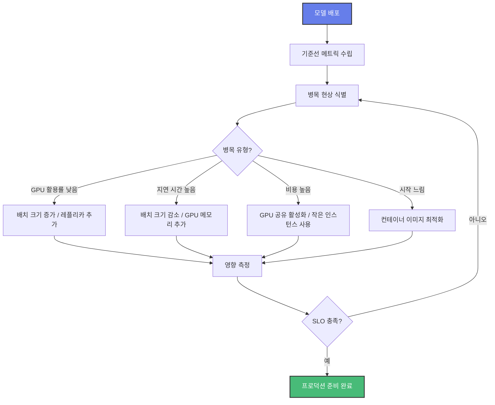

# Amazon EKS에서의 모델 추론 라이프사이클

이 가이드는 인프라 설정부터 프로덕션 최적화까지, Amazon EKS에서 대규모 언어 모델(LLM) 추론을 배포하고 최적화하는 전체 라이프사이클을 안내합니다.

## 라이프사이클 개요

모델 추론 라이프사이클은 세 가지 핵심 단계로 구성됩니다:


각 단계는 특정 과제를 해결하고 대규모 LLM 추론 성공에 필요한 구성 요소를 제공합니다.

---

## [1단계: 인프라 설정](./inference-ready-cluster.md)

### 인프라가 중요한 이유

LLM을 배포하기 전에 AI/ML 워크로드의 고유한 요구사항을 처리할 수 있는 견고하고 확장 가능한 인프라가 필요합니다:

- **GPU/Neuron 리소스 관리**: LLM에는 적절한 디바이스 플러그인과 드라이버가 있는 특수 가속기(NVIDIA GPU 또는 AWS Inferentia/Trainium 칩)가 필요합니다
- **오토스케일링 기능**: 비용을 최적화하면서 다양한 추론 수요를 처리하기 위한 동적 워크로드 스케일링
- **관측성 기반**: GPU/Neuron 활용률, 모델 성능 및 시스템 상태에 대한 모니터링 및 메트릭 수집
- **분산 컴퓨팅 지원**: 모델이 단일 노드 용량을 초과하는 경우를 위한 멀티 노드 추론 인프라

### 솔루션: 추론 준비 클러스터

[**추론 준비 EKS 클러스터**](./inference-ready-cluster.md)는 AI/ML 추론 워크로드를 위해 특별히 설계된 사전 구성된 인프라를 제공합니다.

#### 제공 내용

- **사전 설치된 구성 요소**:
  - 분산 Ray 워크로드를 위한 KubeRay Operator
  - 멀티 노드 분산 추론을 위한 LeaderWorkerSet
  - GPU 관리를 위한 NVIDIA Device Plugin
  - Inferentia/Trainium 지원을 위한 AWS Neuron Device Plugin
  - 지능형 노드 오토스케일링을 위한 Karpenter

- **내장 관측성**:
  - 메트릭 수집을 위한 Prometheus
  - AI/ML 전용 대시보드가 있는 Grafana
  - GPU 메트릭을 위한 DCGM Exporter
  - 시스템 수준 메트릭을 위한 Node Exporter

- **AIBrix 통합**:
  - 고급 추론 최적화 기능
  - 트래픽 관리를 위한 게이트웨이 및 라우팅
  - 성능 모니터링 도구

#### 주요 고려사항

인프라를 설정할 때 다음을 고려하세요:

1. **하드웨어 선택**: 모델 요구사항과 비용 제약에 따라 NVIDIA GPU(P4d, P5, G5)와 AWS Neuron(Inf2, Trn1) 중 선택
2. **스케일링 전략**: 모델 크기에 따라 단일 노드 또는 멀티 노드 추론 필요 여부 결정
3. **네트워크 구성**: 모델 로딩 및 추론 트래픽을 위한 충분한 대역폭으로 적절한 VPC 설정 보장
4. **스토리지 요구사항**: 모델 크기 및 액세스 패턴에 따라 모델 아티팩트 스토리지(S3, EFS 또는 FSx) 계획

#### 시작하기

인프라를 프로비저닝하려면 [추론 준비 클러스터 배포 가이드](./inference-ready-cluster.md)를 따르세요.

---

## [2단계: 모델 배포](../../blueprints/inference/inference-charts.md)

### 배포 패턴이 중요한 이유

인프라가 준비되면 LLM 배포에는 다음에 대한 신중한 고려가 필요합니다:

- **프레임워크 선택**: 다양한 프레임워크(vLLM, Ray-vLLM, Triton)는 성능, 기능 및 복잡성에서 서로 다른 트레이드오프를 제공
- **모델 호환성**: 모든 모델이 모든 프레임워크에서 작동하는 것은 아님; 일부는 특정 최적화 필요
- **리소스 할당**: 적절한 GPU/Neuron 메모리 할당 및 요청/제한 구성
- **스케일링 동작**: 오토스케일링이 있는 단일 레플리카 vs 다중 레플리카 배포

### 솔루션: 추론 차트

[**AI on EKS 추론 차트**](../../blueprints/inference/inference-charts.md)는 인기 모델을 위한 사전 구성된 값이 포함된 Helm 기반 배포를 제공하며, 여러 배포 프레임워크를 지원합니다.

#### 지원 프레임워크

- **vLLM**: 최적화된 CUDA 커널로 빠른 단일 노드 추론
- **Ray-vLLM**: 오토스케일링 및 로드 밸런싱이 있는 분산 추론
- **Triton-vLLM**: 고급 기능이 있는 프로덕션 레디 추론 서버
- **LeaderWorkerSet-vLLM**: 단일 노드에 맞지 않는 모델을 위한 멀티 노드 추론
- **Diffusers**: 이미지 생성 모델을 위한 Hugging Face Diffusers

#### 예제: Llama 3.2 1B 배포

추론 차트를 사용하여 Llama 모델을 배포하는 과정을 살펴보겠습니다:

**1단계: Hugging Face 토큰 시크릿 생성**

```bash
kubectl create secret generic hf-token \
  --from-literal=token=your_huggingface_token
```

**2단계: 모델 배포**

```bash
# GPU에서 vLLM으로 Llama 3.2 1B 배포
helm install llama-inference ./blueprints/inference/inference-charts \
  --values ./blueprints/inference/inference-charts/values-llama-32-1b-vllm.yaml
```

**3단계: 배포 확인**

```bash
# 파드 상태 확인
kubectl get pods -l app=llama-inference

# 서비스 엔드포인트 확인
kubectl get svc llama-inference
```

**4단계: 추론 테스트**

```bash
# 서비스에 포트 포워딩
kubectl port-forward svc/llama-inference 8000:8000

# 테스트 요청 전송
curl http://localhost:8000/v1/completions \
  -H "Content-Type: application/json" \
  -d '{
    "model": "meta-llama/Llama-3.2-1B",
    "prompt": "양자 컴퓨팅을 간단하게 설명해주세요:",
    "max_tokens": 100
  }'
```

#### 사용 가능한 사전 구성 모델

추론 차트에는 다음 모델을 위한 즉시 배포 가능한 구성이 포함되어 있습니다:

**언어 모델**:
- DeepSeek R1 Distill Llama 8B
- Llama 3.2 1B, Llama 4 Scout 17B
- Mistral Small 24B
- GPT OSS 20B
- Qwen3 1.7B

**Diffusion 모델**:
- FLUX.1 Schnell
- Stable Diffusion XL, Stable Diffusion 3.5
- Kolors, OmniGen

**Neuron 최적화**:
- AWS Inferentia에서의 Llama 2 13B

#### 주요 고려사항

모델을 배포할 때 다음을 고려하세요:

1. **모델 크기 vs 하드웨어**: 선택한 인스턴스 유형이 모델에 충분한 GPU/Neuron 메모리를 가지고 있는지 확인
2. **배치 크기 구성**: 최적의 처리량 vs 지연 시간 트레이드오프를 위해 배치 크기 튜닝
3. **양자화 옵션**: 메모리 사용량을 줄이기 위해 양자화된 모델(INT8, INT4) 사용 고려
4. **레플리카 수**: 단일 레플리카로 시작하고 관찰된 부하에 따라 확장
5. **헬스 체크**: 적절한 liveness 및 readiness 프로브 구성

#### 시작하기

상세한 구성 옵션과 고급 배포 시나리오는 [추론 차트 문서](../../blueprints/inference/inference-charts.md)를 참조하세요.

---

## [3단계: 최적화](../../guidance/index.md)

### 최적화가 중요한 이유

모델을 배포한 후 최적화는 다음을 보장합니다:

- **비용 효율성**: 성능 요구사항을 충족하면서 인프라 비용 최소화
- **성능 튜닝**: 목표 지연 시간 및 처리량 SLO 달성
- **리소스 활용**: GPU/Neuron 활용률을 극대화하여 고가 하드웨어에서 최대 가치 확보
- **운영 우수성**: 모니터링, 알림 및 문제 해결을 위한 모범 사례 구현

### 최적화 기법

[**가이던스 섹션**](../../guidance/index.md)은 프로덕션 AI/ML 워크로드를 위한 포괄적인 모범 사례와 최적화 기법을 제공합니다. 각 기법은 특정 성능 또는 비용 과제를 해결합니다:

#### [컨테이너 시작 시간 최적화](../../guidance/container-startup-time/index.md)

모델 로딩 시간을 수 분에서 수 초로 줄여 오토스케일링 응답성과 개발 반복 속도를 개선합니다.

**주요 기법**:
- **[이미지 크기 줄이기](../../guidance/container-startup-time/1-reduce-container-image-size/index.md)**: 풀 시간을 최소화하기 위해 컨테이너 이미지 최적화
- **[모델 아티팩트 분리](../../guidance/container-startup-time/1-reduce-container-image-size/14-decoupling-model-artifacts.md)**: 컨테이너 이미지에서 모델 가중치 분리
- **[풀 프로세스 가속화](../../guidance/container-startup-time/2-accelerate-pull-process/index.md)**: containerd 스냅샷터 및 이미지 프리패칭 사용
- **[노드에 프리패치](../../guidance/container-startup-time/2-accelerate-pull-process/14-prefecthing-images-on-br.md)**: 워크로드 스케줄링 전에 모델 이미지로 노드 예열

**효과**: 시작 시간을 60-80% 단축하여 더 빠른 오토스케일링과 낮은 비용을 가능하게 합니다.

**사용 시기**: 오토스케일링 워크로드, 개발 환경 및 비용에 민감한 배포에 중요합니다.

---

#### [동적 리소스 할당 (DRA)](../../guidance/dynamic-resource-allocation.md)

세밀한 리소스 제어와 향상된 활용률을 위한 차세대 GPU 스케줄링입니다.

**주요 기능**:
- **세밀한 GPU 제어**: 전체 디바이스 대신 특정 GPU 메모리 양 요청
- **워크로드별 공유**: 파드별로 MPS, 타임 슬라이싱, MIG 또는 전용 모드 선택
- **토폴로지 인식 스케줄링**: NVLink 및 GPU 인터커넥트 최적화
- **P6e 필수**: Amazon EC2 P6e-GB200 UltraServer에 필수

**효과**: GPU 활용률을 30-40%에서 70-90%로 증가시켜 인프라 비용을 50% 이상 절감합니다.

**사용 시기**:
- 단일 GPU에서 여러 소규모 모델 실행
- 정밀한 GPU 메모리 할당 필요
- 최신 GPU 인스턴스(P6e) 사용
- 워크로드 전체에서 GPU 활용률 최적화

---

#### [관측성 및 모니터링](../../guidance/observability.md)

성능 최적화 및 문제 해결을 위한 추론 워크로드의 종합적인 가시성입니다.

**포함 내용**:
- **GPU/Neuron 메트릭**: 활용률, 메모리 사용량 및 온도 추적
- **모델 성능**: 지연 시간, 처리량 및 오류율 모니터링
- **시스템 상태**: CPU, 메모리, 네트워크 및 스토리지 메트릭
- **커스텀 대시보드**: 추론 워크로드를 위한 사전 구축된 Grafana 대시보드

**주요 모니터링 메트릭**:
- GPU 활용률 (비용 효율성을 위한 목표: >70%)
- 추론 지연 시간 (P50, P95, P99)
- 초당 요청 수 (처리량)
- 큐 깊이 (오토스케일링 결정용)
- 모델 로딩 시간

**효과**: 데이터 기반 최적화 결정과 사전 문제 감지를 가능하게 합니다.

---

#### [네트워킹 최적화](../../guidance/networking.md)

고처리량 추론 워크로드를 위한 네트워크 구성을 최적화합니다.

**주요 영역**:
- **VPC 설계**: 적절한 서브넷 크기 조정 및 가용 영역 분배
- **로드 밸런싱**: 추론 엔드포인트를 위한 ALB/NLB 구성
- **서비스 메시**: 고급 트래픽 관리를 위한 Istio/Linkerd
- **네트워크 정책**: 워크로드 간 보안 및 격리

**효과**: 네트워크 지연 시간을 20-40% 줄이고 안정성을 개선합니다.

---

#### [EKS 모범 사례](../../guidance/eks-best-practices.md)

보안, 안정성, 성능 및 비용 최적화를 위한 종합 가이드입니다.

**다루는 주제**:
- 보안 및 규정 준수
- 안정성 및 가용성
- 성능 최적화
- 비용 최적화

---

### 최적화 워크플로우

추론 배포를 최적화하기 위해 다음 워크플로우를 따르세요:



#### 시작하기

각 최적화 기법에 대해 자세히 알아보려면 [가이던스 문서](../../guidance/index.md)를 참조하세요.

---

## 전체 라이프사이클 예제

인프라부터 최적화된 프로덕션까지 Llama 3.2 1B를 배포하는 전체 예제입니다:

### 1단계: 인프라 배포

```bash
# 리포지토리 클론
git clone https://github.com/awslabs/ai-on-eks.git
cd ai-on-eks/infra/solutions/inference-ready-cluster

# 배포 구성
cp blueprint.tfvars.example blueprint.tfvars
# blueprint.tfvars를 설정에 맞게 편집

# 인프라 배포
terraform init
terraform apply -var-file=blueprint.tfvars
```

### 2단계: 모델 배포

```bash
# kubeconfig 업데이트
aws eks update-kubeconfig --name <cluster-name> --region <region>

# Hugging Face 토큰 시크릿 생성
kubectl create secret generic hf-token \
  --from-literal=token=<your-token>

# Llama 3.2 1B 배포
helm repo add ai-on-eks https://awslabs.github.io/ai-on-eks-charts/
helm repo update

helm install qwen3-1-7b ai-on-eks/inference-charts \
  -f https://raw.githubusercontent.com/awslabs/ai-on-eks-charts/refs/heads/main/charts/inference-charts/values-llama-32-1b-vllm.yaml
```

### 3단계: 최적화 (지속적)

```bash
# 모니터링을 위해 Grafana 접근
kubectl port-forward -n monitoring svc/kube-prometheus-stack-grafana 3000:80

# GPU 활용률 모니터링 및 레플리카 조정
kubectl scale deployment llama-inference --replicas=3

# 큐 깊이 기반 오토스케일링 활성화
kubectl autoscale deployment llama-inference \
  --min=2 --max=10 --cpu-percent=70
```

---

## 다음 단계

모델 추론 라이프사이클 전체를 이해했으니, 출발점을 선택하세요:

- **EKS가 처음이신가요?** [인프라 설정](./inference-ready-cluster.md)부터 시작하세요
- **인프라가 있으신가요?** [모델 배포](../../blueprints/inference/inference-charts.md)로 바로 이동하세요
- **모델이 실행 중인가요?** [가이던스](../../guidance/index.md)로 최적화하세요

## 추가 리소스

- [AI on EKS GitHub 리포지토리](https://github.com/awslabs/ai-on-eks)
- [AWS EKS 문서](https://docs.aws.amazon.com/eks/)
- [NVIDIA GPU Operator](https://docs.nvidia.com/datacenter/cloud-native/gpu-operator/)
- [AWS Neuron 문서](https://awsdocs-neuron.readthedocs-hosted.com/)
- [vLLM 문서](https://docs.vllm.ai/)
- [Ray 문서](https://docs.ray.io/)

## 커뮤니티 및 지원

- [GitHub Issues](https://github.com/awslabs/ai-on-eks/issues) - 버그 리포트 또는 기능 요청
- [GitHub Discussions](https://github.com/awslabs/ai-on-eks/discussions) - 질문 및 경험 공유
- [AWS re:Post](https://repost.aws/) - AWS 전문가 및 커뮤니티의 도움 받기
